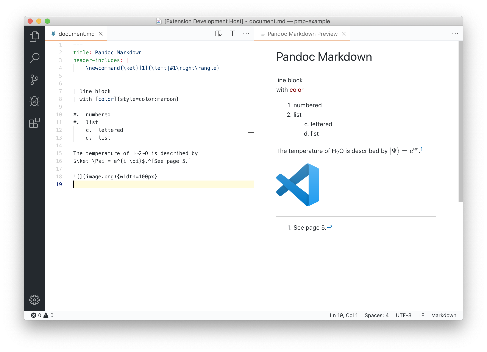

# Pandoc Markdown Preview

A Visual Studio Code extension that allows previewing markdown files written in Pandoc Markdown by using pandoc to compile them. Adds a command "Open Pandoc Markdown Preview" with a default key binding of `ctrl+shift+r` or `cmd+shift+r` on mac.

## Features

- Live Update
- KaTeX Math Rendering
- Markdown files can load local images and resources

## Screenshot

## Requirements

Pandoc must be installed and in `$PATH`.

<!--
## Known Issues

Calling out known issues can help limit users opening duplicate issues against your extension.
-->

## Release Notes

### 0.2.0

Added configuration setting for extra pandoc command-line arguments.
